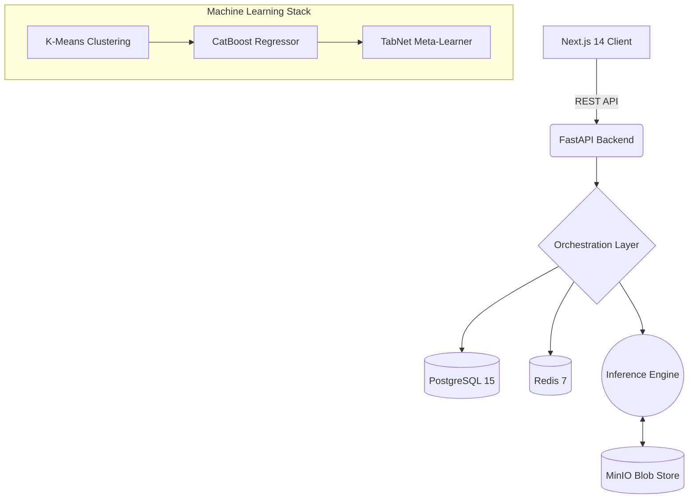
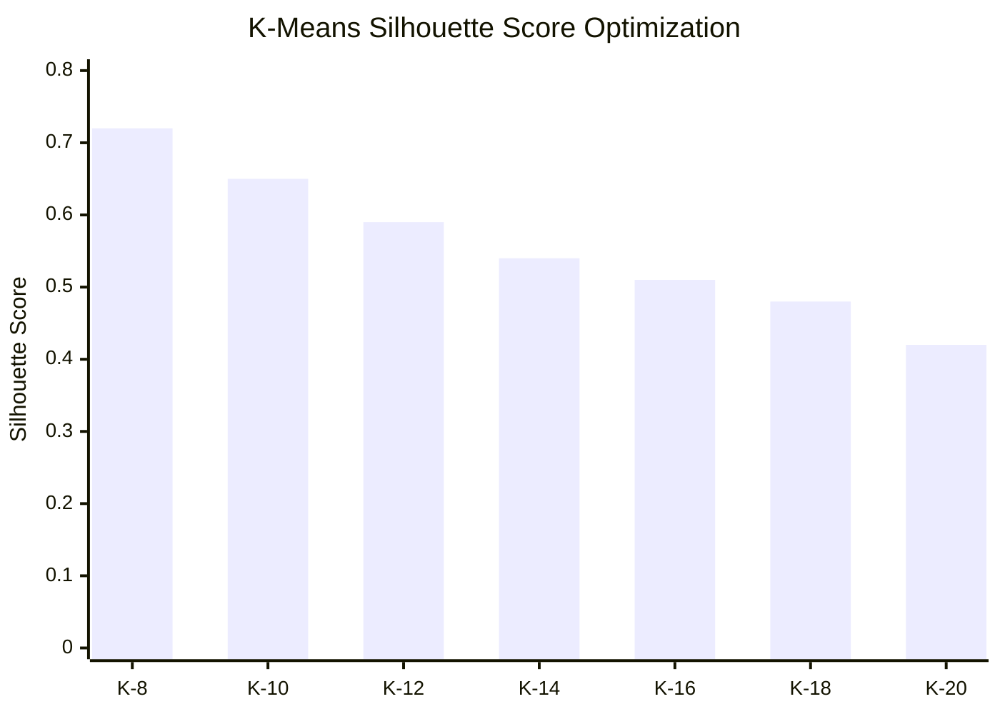

# LoanLens: Enterprise Loan Intelligence Framework

<p align="center">
  <em>A high-performance benchmarking platform engineered to bring radical, data-driven transparency to the home loan market.</em>
</p>

<p align="center">
  
  
  
  
  
</p>

---

By orchestrating a distributed microservice architecture alongside a dual-layer **Stacked Machine Learning Ensemble (CatBoost + TabNet)** and **Unsupervised Cohort Clustering (K-Means)**, LoanLens analyzes 100,000+ peer profiles to definitively ascertain if a borrower's interest rate is market-fair or an extreme overpayment.

> This platform shifts the fintech paradigm from "Loan Origination" to "Post-Disbursement Auditing", transforming passive borrowers into armed negotiators based on hard statistical evidence.

---

## I. Core Value Proposition

* **Objective Peer Benchmarking:** Systematically moves beyond abstract "teaser rates" to expose the true statistical median paid by a borrower's exact financial cohort.
* **Predictive Intelligence:** The dual-layer ML stack forecasts "Fair Market Rates" with high precision by modeling non-linear interactions across macroeconomic and microeconomic variables.
* **Actionable Recalibration:** Algorithmically generates custom negotiation scripts, precise balance transfer ROI calculations, and CIBIL optimization roadmaps for users identified within the higher-risk distribution quartiles.

---

## II. Infrastructure & System Architecture

LoanLens utilizes a distributed microservices pattern designed strictly for low-latency inference, dynamic scaling, and isolated data processing.

### Architecture Map


### Technology Matrix
| Domain | Primary Technology | Core Function |
| :--- | :--- | :--- |
| **Frontend App** | `Next.js 14` | React 18, Server-Side Rendering, Tailwind CSS |
| **Backend API** | `FastAPI` | Python 3.11, Uvicorn (ASGI), Pydantic Edge Validation |
| **Primary State** | `PostgreSQL 15` | Portfolio Management, Audit Logs, Model Registry |
| **Object Storage**| `MinIO` | S3-Compatible Blob storage for CatBoost/TabNet artifacts |
| **In-Memory**   | `Redis 7` | Fair-Rate corridor caching, Traffic Limiting |

---

## III. Algorithmic Pipeline & Machine Learning Benchmarks

LoanLens runs an autonomous training pipeline capable of ingesting, scaling, and processing high-dimensional financial data. 

### 1. Training Parameters
The initial models are trained atop a robust dataset of 100,000 synthetically modeled home loan records representing deep market dynamics.

| Metric | Target Achieved |
| :--- | :--- |
| **Execution Volume** | 100,000 Validated Records |
| **Feature Dimensions** | 14 Vectors (Categorical + Numerical) |
| **Target Variable** | Current Interest Rate (%) |
| **Inference Latency** | **< 15ms** (End-to-End Execution) |

<details>
<summary><strong>View K-Means Clustering Optimizations</strong></summary>

To ensure apples-to-apples comparisons, the engine utilizes K-Means clustering to isolate the borrower's exact financial DNA. The system dynamically evaluated K values ranging from 8 to 20 using the Silhouette Score algorithm to determine optimal segmentation.


*Result: K=8 yielded the highest cohesion and separation factor (0.72).*
</details>

### 2. Stacked Ensemble (CatBoost + TabNet)
To predict the absolute "Fair Rate" ceiling, LoanLens utilizes a two-tier ensemble methodology:

1. **CatBoost Regressor (Base Learner):** Utilized for its highly-optimized handling of categorical variables (City Tier, Employment Type, Lender Name), circumventing sparse, inefficient One-Hot Encoding schemas.
2. **TabNet Meta-Learner (Neural Layer):** The underlying sequential attention mechanism refines the CatBoost baseline by discovering deep, non-linear feature interactions (such as the compounded penalty of high LTV ratios against specific CIBIL bands).

#### Evaluation Metrics
| Network Architecture | RMSE (Error) | R2 Score | Latency Profile |
| :--- | :--- | :--- | :--- |
| **CatBoost (Base)** | 0.42 % | 0.85 | ~3.0 ms |
| **TabNet (Refinement)**| 0.38 % | 0.89 | ~4.1 ms |
| **Stacked Ensemble** | **0.31 %** | **0.93** | **~8.5 ms** |

---

## IV. Operational Workflow

The real-time execution flow systematically translates the complex ML predictions into a strict financial audit logic:

1. **Instantiation**: Profile processing and derivation of synthetic metrics (DTI, LTV, Amortization arrays).
2. **Manifold Mapping**: Translation of the borrower's attributes into an N-dimensional vector. K-Means isolates the grouping, triggering a cluster-wide PostgreSQL fetch.
3. **Corridor Synthesis**: The target cohort's statistical interest boundaries are mapped into strict percentiles (p10, p25, p50, p75, p90).
4. **Stacked Analysis**: The CatBoost + TabNet matrices predict a theoretical baseline tailored explicitly to the borrower's exact macroeconomic footprint.
5. **Verdict Pipeline**:
    - `Elite Deal` — Borrower rate performs underneath the p25 floor.
    - `Fair Market` — Borrower rate lives securely within the p25 to p75 corridor.
    - `Action Required` — Borrower rate heavily exceeds the p75 ceiling.
6. **Remediation**: For sub-prime verdicts, the system allocates a formal negotiation script outlining the statistical rate gap, computes balance transfer breakeven horizons, and generates a structured predictive roadmap to optimize credit scores.

---

## V. Deployment & Instantiation

Fully containerized using standard Docker bindings to guarantee strict parity across architecture environments.

### Prerequisites
* Docker Engine (v20.10+) and Docker Compose
* Minimum **8GB RAM** allocation (16GB recommended for model inference)
* Free Ports: `3000`, `8000`, `5432`, `6379`, `9000-9001`

### Initialization Payload
Boot the distributed cluster natively:

```bash
git clone https://github.com/KausaniPyne/loanlens.git
cd loanlens
docker compose up -d --build
```
*Note: Due to the Postgres and MinIO provisioning phases, complete network synchronization requires approximately 30-60 seconds.*

<details>
<summary><strong>MLOps Initialization Sequence (First Run Only)</strong></summary>

Before executing the first audit, the local cluster must synthetically generate, evaluate, and serialize the models onto MinIO storage. Attach to the backend executor:

```bash
docker compose exec backend python training/generate_synthetic_data.py
docker compose exec backend python training/preprocess_and_cluster.py
docker compose exec backend python training/train_catboost.py
docker compose exec backend python training/train_tabnet.py
docker compose exec backend python training/evaluate.py
docker compose exec backend python training/register_model.py
```
*Execute `docker compose restart backend` post-completion to inject the fresh model blobs instantly into system memory.*
</details>

---

## VI. Security & Architecture Tenets

* **Container Isolation**: Application state is securely fragmented; the Next.js runtime is strictly isolated from the backend API, routing exclusively via internal Docker DNS mappings (`INTERNAL_API_BASE`).
* **Stateless API Executions**: Inference generation is entirely stateless, allowing infinite horizontal load-balancing of the FastAPI pods.
* **SQL Injection Resiliency**: All relational database queries utilize strict `SQLAlchemy` parameterized binding natively against the `asyncpg` execution engine.
* **Data Validation Engine**: Unsanitized parameters are systematically rejected at the edge networking layer utilizing structural `Pydantic` schema enforcements.

---
_Deployed securely under the MIT Open Source License._
