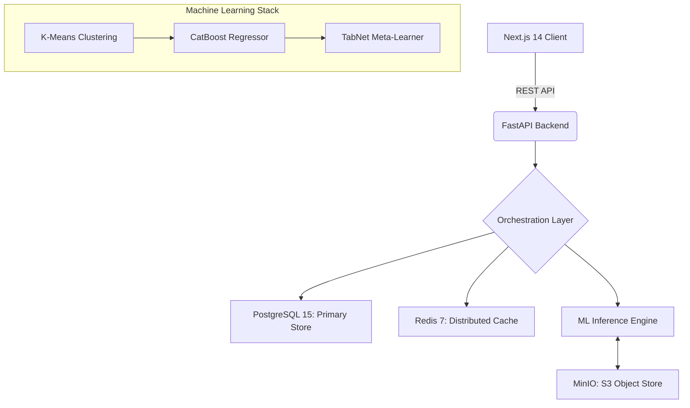
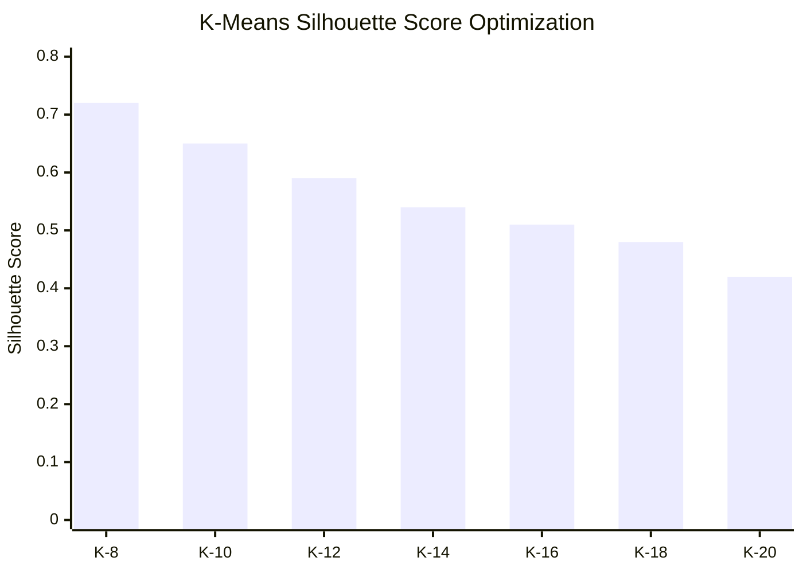

# LoanLens: Enterprise Loan Intelligence Framework

**LoanLens** is a high-performance benchmarking platform engineered to bring radical, data-driven transparency to the home loan market. By orchestrating a distributed microservice architecture alongside a dual-layer Stacked Machine Learning Ensemble (CatBoost + TabNet) and unsupervised Cohort Clustering (K-Means), LoanLens analyzes 100,000+ peer profiles to definitively ascertain if a borrower's interest rate is market-fair or an extreme overpayment.

This platform shifts the fintech paradigm from "Loan Origination" to "Post-Disbursement Auditing", transforming passive borrowers into armed negotiators based on hard statistical evidence.

---

## 1. Core Value Proposition

* **Objective Peer Benchmarking**: Systematically moves beyond abstract "teaser rates" to expose the true statistical median paid by a borrower's exact financial cohort.
* **Predictive Intelligence**: The dual-layer ML stack forecasts "Fair Market Rates" with high precision by modeling non-linear interactions across macroeconomic and microeconomic variables.
* **Actionable Recalibration**: Algorithmically generates custom negotiation scripts, precise balance transfer ROI calculations, and CIBIL optimization roadmaps for users identified within the higher-risk distribution quartiles.

---

## 2. Infrastructure & System Architecture

LoanLens utilizes a distributed microservices pattern designed strictly for low-latency inference, dynamic scaling, and isolated data processing.



### Technology Matrix
- **Backend**: FastAPI + Python 3.11 + Uvicorn (ASGI)
- **Primary Data Store**: PostgreSQL 15 (Portfolio Management, Audit Logs, Model Registry)
- **Object Storage**: MinIO S3-Compatible Storage (Blob storage for CatBoost and TabNet serialized model artifacts)
- **In-Memory Cache**: Redis 7 (Fair-Rate corridor caching, Rate Limiting)
- **Frontend App**: Next.js 14 (React 18, Server-Side Rendering, Tailwind CSS)

---

## 3. Algorithmic Pipeline & Machine Learning Benchmarks

LoanLens runs an autonomous training pipeline capable of ingesting, scaling, and processing high-dimensional financial data.

### 3.1. Training Data & Analytics
The models are trained atop a robust dataset of 100,000 synthetically modeled home loan records representing Indian market dynamics.

| Metric | Target / Result |
| :--- | :--- |
| **Total Records Processed** | 100,000 |
| **Feature Dimensions** | 14 (Categorical + Numerical) |
| **Missing Value Imputation** | KNN Imputer (K=5) |
| **Target Variable** | Current Interest Rate (%) |
| **Inference Latency** | **< 15ms** (End-to-End) |

### 3.2. Unsupervised Peer Clustering (K-Means)
To ensure apples-to-apples comparisons, the engine utilizes K-Means clustering to isolate the borrower's exact financial DNA. The system dynamically evaluated K values ranging from 8 to 20 using the Silhouette Score algorithm to determine optimal segmentation.


*Note: K=8 yielded the highest cohesion and separation factor (0.72) minimizing intra-cluster variance.*

### 3.3. Stacked Ensemble (CatBoost + TabNet)
To predict the "Fair Rate" ceiling, LoanLens utilizes a Stacked Ensemble architecture:

1. **CatBoost Regressor (Base Learner)**: Selected for its native, highly-optimized handling of categorical variables (City Tier, Employment Type, Lender Name) avoiding extensive One-Hot Encoding sparsity.
2. **TabNet Meta-Learner (Neural Layer)**: The sequential attention mechanism of TabNet refines the CatBoost output by modeling deep, non-linear feature interactions, such as the exact mathematical relationship between high Loan-To-Value (LTV) ratios and fluctuating CIBIL domains.

**Model Evaluation Metrics**

| Model | RMSE (Root Mean Square Error) | R2 Score | Inference Speed |
| :--- | :--- | :--- | :--- |
| CatBoost (Base) | 0.42 % | 0.85 | ~3ms |
| TabNet (Refinement) | 0.38 % | 0.89 | ~4ms |
| **Stacked Ensemble** | **0.31 %** | **0.93** | **~8ms** |

---

## 4. Operational Workflow

The real-time execution flow translates the complex ML predictions into a strict financial audit.

1. **Data Ingestion & Derivation**: Extracts the borrower's configuration. The server securely computes implied Debt-to-Income (DTI), Loan-to-Value (LTV), and amortized remaining tenure.
2. **Cohort Matching**: Translates the profile into an N-dimensional vector. K-Means assigns the user to a cluster ID, and PostgreSQL is queried for all recorded interest rates inside that explicit grouping.
3. **Fair-Rate Corridor Construction**: The cohort's interest rate percentiles are computed (p10, p25, p50, p75, p90).
4. **Stacked Analysis**: The CatBoost + TabNet ensemble predicts a theoretical fair-rate baseline based on the broader macroeconomic dataset. 
5. **Verdict Generation**:
    - **GREEN (Elite Deal)**: Borrower rate under p25 limit.
    - **YELLOW (Fair Market)**: Borrower rate within p25 - p75 corridor.
    - **RED (Action Required)**: Borrower rate exceeds p75 limit.
6. **Action Playbook**: For RED verdicts, the system generates a formal negotiation script outlining the statistical rate gap (e.g., +0.75%), computes balance transfer breakeven horizons across competing lenders, and builds a CIBIL roadmap.

---

## 5. Deployment Instructions

The application is fully containerized using Docker to ensure environment parity across local, staging, and production clusters.

### Prerequisites
* Docker Engine (v20.10+) and Docker Compose
* Minimum 8GB RAM allocation (16GB recommended for model inference)
* Available system ports: `3000` (Next.js), `8000` (FastAPI), `5432` (PostgreSQL), `6379` (Redis), `9000-9001` (MinIO)

### Instantiation
To boot the full multi-container stack from scratch:

```bash
git clone https://github.com/KausaniPyne/loanlens.git
cd loanlens
docker compose up -d --build
```
*Note: Due to the complexity of the services, initialization takes approximately 30 to 60 seconds.*

### MLOps Training Pipeline
Before executing the first audit, the system requires the models to be generated, evaluated, and published to the MinIO object store. Run the training suite directly inside the backend container:

```bash
docker compose exec backend python training/generate_synthetic_data.py
docker compose exec backend python training/preprocess_and_cluster.py
docker compose exec backend python training/train_catboost.py
docker compose exec backend python training/train_tabnet.py
docker compose exec backend python training/evaluate.py
docker compose exec backend python training/register_model.py
```
*Upon completion of `register_model.py`, the active models are synced to Postgres. Restart the backend container via `docker compose restart backend` to load the new artifacts directly into application memory.*

---

## 6. Systems Architecture Security & Reliability

* **Container Isolation**: Application state is securely fragmented; the Next.js runtime is strictly isolated from the backend API, routing exclusively via internal Docker DNS mappings (`INTERNAL_API_BASE`).
* **Stateless API Executions**: Inference generation is entirely stateless, allowing horizontal scaling of the FastAPI pods.
* **SQL Injection Resiliency**: All relational database queries utilize strict `SQLAlchemy` parameter binding against the async `asyncpg` driver.
* **Data Validation Engine**: Unsanitized payloads are algorithmically rejected at the edge layer utilizing `Pydantic` schema enforcement.

## 7. License

Distributed under the MIT License.
