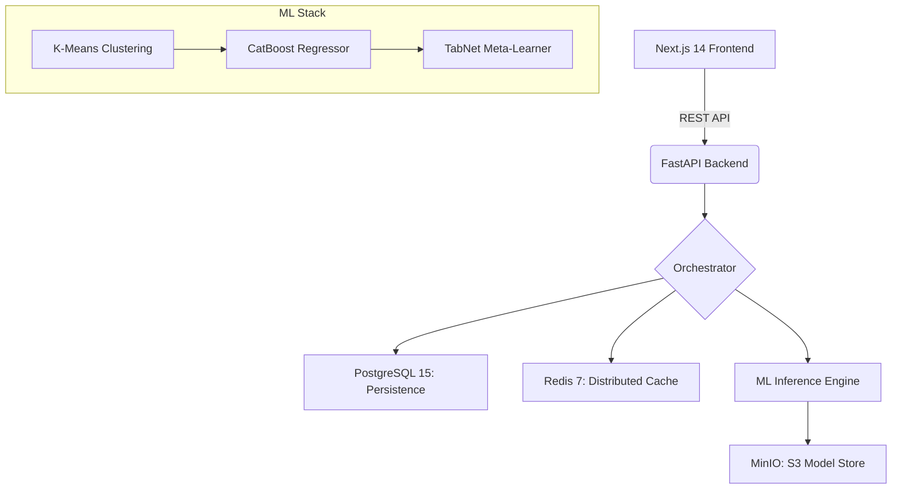

# 🚀 LoanLens: Enterprise Loan Intelligence Engine

**LoanLens** is a high-performance benchmarking platform that brings radical transparency to the home loan market. By leveraging a **Stacked Ensemble (CatBoost + TabNet)** and **K-Means Clustering**, it analyzes 100,000+ peer profiles to determine if a borrower's interest rate is market-fair or an overpayment.

    

---

## 💎 Core Value Proposition

* **Objective Benchmarking**: Moves beyond "teaser rates" to show what borrowers with your *exact* financial DNA are actually paying.
* **Predictive Intelligence**: Dual-layer ML stack forecasts "Fair Market Rates" with high precision by modeling non-linear interactions.
* **Actionable Recalibration**: Generates custom negotiation scripts and refinancing ROI calculations for users in the "RED" zone.

---

## 🏗️ System Architecture

LoanLens utilizes a distributed microservices architecture designed for low-latency inference and scalable data processing.



```
┌─────────────┐     ┌───────────────┐     ┌──────────────┐
│  Next.js 14 │────▶│  FastAPI      │────▶│ PostgreSQL 15│
│  (React 18) │     │  (Python)     │     └──────────────┘
└─────────────┘     │               │     ┌──────────────┐
                    │  CatBoost     │────▶│  Redis 7     │
                    │  TabNet       │     └──────────────┘
                    │  K-Means      │     ┌──────────────┐
                    └───────────────┘────▶│  MinIO (S3)  │
                                          └──────────────┘
```

- **Backend**: FastAPI + Python 3.11
- **ML Engine**: CatBoost + TabNet stacked ensemble, K-Means clustering (8 clusters, 100K synthetic records)
- **Database**: PostgreSQL 15 (loan portfolio + audit logs + model registry)
- **Cache**: Redis 7 (corridor caching + rate limiting)
- **Model Storage**: MinIO (S3-compatible object store)
- **Frontend**: Next.js 14 + Tailwind CSS + Recharts + Zustand

---

## ⚡ Quick Start

### Prerequisites

* **Engine**: Docker Desktop (latest)
* **Hardware**: 8 GB RAM minimum
* **Ports**: `3000`, `8000`, `5432`, `6379`, `9000-9001` must be free

### One-Command Setup

```bash
git clone https://github.com/KausaniPyne/loanlens.git
cd loanlens
docker compose up --build
```

Wait approximately 2–3 minutes for all services to initialize and show healthy status.

---

## 🧠 Run Training Pipeline (required before first use)

Open a **new terminal** after `docker compose up` has finished:

```bash
docker compose exec backend python training/generate_synthetic_data.py
docker compose exec backend python training/preprocess_and_cluster.py
docker compose exec backend python training/train_catboost.py
docker compose exec backend python training/train_tabnet.py
docker compose exec backend python training/evaluate.py
docker compose exec backend python training/register_model.py
```

Total training time: approximately 8–15 minutes on a standard laptop CPU.

After training completes, **restart the backend** to load models into memory:

```bash
docker compose restart backend
```

---

## 📊 Access the Application

| Service | URL | Credentials |
| :--- | :--- | :--- |
| **Frontend** | [http://localhost:3000](http://localhost:3000) | — |
| **API Docs** | [http://localhost:8000/docs](http://localhost:8000/docs) | — |
| **MinIO Console** | [http://localhost:9001](http://localhost:9001) | `minioadmin` / `minioadmin123` |

---

## 🎮 Demo Mode

Click **"Load Green Demo"**, **"Load Yellow Demo"**, or **"Load Red Demo"** on the audit form to instantly load pre-configured profiles and see all three verdict states without manual data entry.

---

## 🔬 How It Works

1. **Data Ingestion** — Parse the borrower's loan configuration and financial profile.
2. **Peer Grouping** — K-Means isolates the borrower's exact financial cohort from 100,000 records.
3. **AI Benchmarking** — CatBoost predicts base rate; TabNet meta-model refines with sequential attention.
4. **The Verdict** — GREEN (elite deal), YELLOW (fair market), or RED (action required) with a full negotiation playbook.

---

## 🛠️ How the Runtime Flow Works

### 1. User Input

- The user enters loan details and profile details in the multi-step form.
- Optional demo buttons can auto-fill a GREEN, YELLOW, or RED case.

### 2. Derived Metrics

- On the server, LoanLens computes EMI, debt-to-income ratio, loan-to-value ratio, and remaining tenure.

### 3. Cohort Matching

- The borrower is converted into a clustering vector.
- K-Means assigns the borrower to a peer group.
- PostgreSQL is queried for all interest rates in that cluster.
- If the cohort is too small, nearby clusters are merged as a fallback.

### 4. Fair-Rate Corridor

- Percentiles p10, p25, p50, p75, and p90 are computed from the cohort.
- GREEN is below p25, YELLOW is between p25 and p75, RED is above p75.

### 5. Stacked Prediction

- CatBoost makes a base rate prediction from structured loan features.
- TabNet then takes scaled borrower features plus the CatBoost prediction and outputs a refined rate.

### 6. Action Layer

- Overpayment is estimated by comparing the current rate with the fair median rate over the remaining tenure.
- If the verdict is RED, a negotiation script, lender-switch options, and a CIBIL roadmap are created.
- The dashboard also lets the user simulate improvements like higher CIBIL or lower LTV.

---

## 🧩 What Is Actually Implemented

### Frontend

- Next.js 14 app with a landing page, 3-step audit form, and verdict dashboard.
- Demo shortcuts for GREEN, YELLOW, and RED profiles are built into the first form step.
- The results dashboard includes verdict banner, rate-position chart, impact cards, key drivers, RED-only playbook, and a what-if simulator.

### Backend

- FastAPI app with routes for audit, simulation, negotiation, balance-transfer, and lenders.
- Redis-backed rate limiting is applied in middleware.
- Models are loaded at startup from MinIO based on the active entry in the model registry.
- Audit requests are persisted in PostgreSQL.

### ML Pipeline

- The training flow generates 100,000 synthetic loan records using a realistic pricing heuristic.
- Preprocessing scales numeric features, encodes employment, city, and lender categories, and selects the best K for K-Means using silhouette score across K=8 to K=20.
- CatBoost is trained first on tabular loan features.
- CatBoost predictions are saved and then fed into TabNet as an extra feature, making the system a stacked ensemble.
- The active model version is registered in the database and loaded by the API at startup.

---

## 🧠 Why the Model Design Is Strong

- **CatBoost** is excellent for tabular finance-style data and handles categorical inputs well.
- **TabNet** adds a neural tabular layer that can model deeper interactions.
- **Stacking** lets the second model learn from the first model's prediction instead of forcing one model to do everything.
- **K-Means** adds a peer-grouping layer, so the system is not just predicting a number in isolation — it also benchmarks the user against a comparable cohort.

---

## 💡 What Makes This Different

- It **audits an existing home loan** instead of only helping a borrower shop for a new one.
- It **combines cohort-based benchmarking with ML prediction**.
- It **turns a red flag into a real action plan** instead of only giving a score.
- It is designed around **borrower advocacy**, not lender marketing.

---

## 🛡️ Pre-Demo Checklist

```
[ ] docker compose down -v  (full reset)
[ ] docker compose up --build  (clean build)
[ ] Wait for all services healthy (docker compose ps)
[ ] Run all 6 training scripts in order
[ ] docker compose restart backend
[ ] Load Green Demo → verify GREEN verdict
[ ] Load Yellow Demo → verify YELLOW verdict
[ ] Load Red Demo → verify RED verdict + all playbook panels
[ ] Run What-If simulation on RED result
[ ] Confirm pipeline_latency_ms < 2000
[ ] Check mobile viewport (375px) for layout
[ ] Browser console errors: 0
```

---

## 📄 License

MIT
